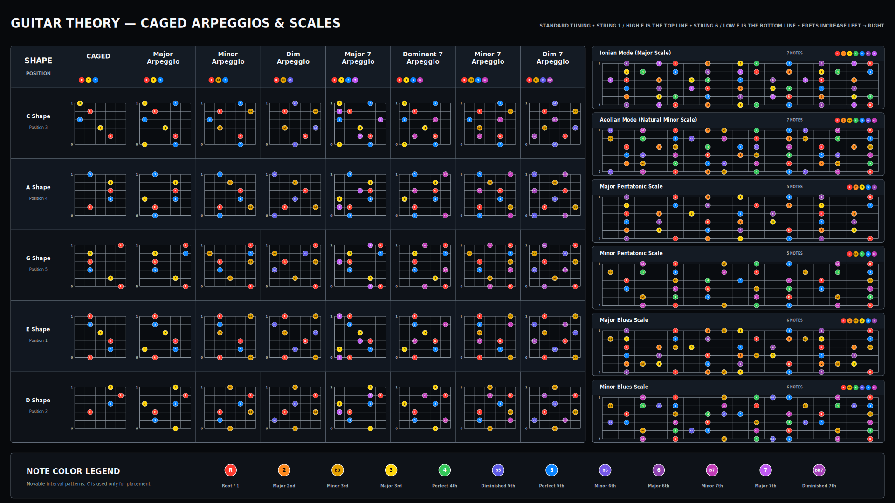
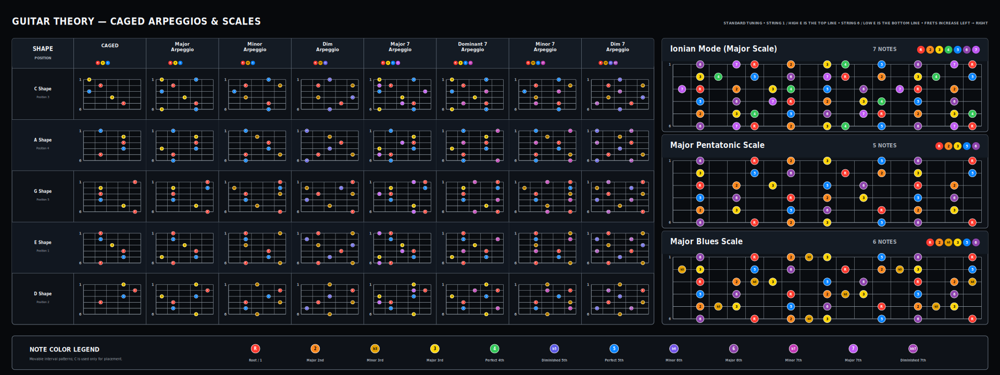

# Guitar Theory Cheatsheet

Programmatically drawn dark-mode guitar theory cheatsheet with:

- String 1 (high E) on the top line and string 6 (low E) on the bottom line
- CAGED and arpeggio diagrams
- Ionian, Aeolian, pentatonic, and blues scale diagrams
- Rainbow interval colors
- 16:9 and 8:3 SVG plus lower-resolution and high-resolution PNG outputs

## Preview

### 16:9

[](guitar_theory_cheatsheet_programmatic_ratio_16_9.svg)

Open the [16:9 SVG](guitar_theory_cheatsheet_programmatic_ratio_16_9.svg) for the scalable version.

### 8:3

[](guitar_theory_cheatsheet_programmatic_ratio_8_3.svg)

Open the [8:3 SVG](guitar_theory_cheatsheet_programmatic_ratio_8_3.svg) for the scalable version.

## Poster Guide

The poster is a movable interval map. C is used only as the drawing reference, so the same shapes can be moved to any root.

- The left side shows the CAGED chord shapes and arpeggios across the C, A, G, E, and D shape positions.
- The right side shows each scale or mode on one continuous fretboard across the connected CAGED cycle: G, E, D, C, A, then back to G.
- The 16:9 poster includes all six scale rows. The 8:3 poster keeps only the major-family rows: Ionian, Major Pentatonic, and Major Blues.
- Fretboards are drawn with string 1, high E, on top and string 6, low E, on the bottom.
- Each colored note is labeled by interval function: `R`, `2`, `b3`, `3`, `4`, `b5`, `5`, `b6`, `6`, `b7`, `7`, or `bb7`.

## Interval Names

Intervals are named by letter distance and size from the root, not only by the fret where the note appears. `b` means lowered one semitone, and `bb` means lowered two semitones.

| Label | Meaning |
| --- | --- |
| `R` or `1` | Root |
| `2` | Major 2nd |
| `b3` | Minor 3rd |
| `3` | Major 3rd |
| `4` | Perfect 4th |
| `b5` | Diminished 5th |
| `5` | Perfect 5th |
| `b6` | Minor 6th |
| `6` | Major 6th |
| `b7` | Minor 7th |
| `7` | Major 7th |
| `bb7` | Diminished 7th |

`bb7` is enharmonically the same pitch as `6` in 12-tone equal temperament, but it has a different harmonic name. In C, `6` is A, while `bb7` is B double-flat. Both sound as A, but a diminished seventh chord is spelled as stacked thirds:

```text
C  Eb  Gb  Bbb
R  b3  b5  bb7
```

Writing the last note as `bb7` shows that it is a seventh chord. Writing it as `6` would describe the same fret, but it would hide the diminished-seventh spelling.

## Formulas

Scale step formulas are measured from one note to the next up to the octave. `1` means a whole step, `1/2` means a half step, and `1 1/2` means three frets.

| Poster item | Interval formula | Step formula |
| --- | --- | --- |
| CAGED major chord | `R 3 5` | - |
| Major arpeggio | `R 3 5` | - |
| Minor arpeggio | `R b3 5` | - |
| Diminished arpeggio | `R b3 b5` | - |
| Major 7 arpeggio | `R 3 5 7` | - |
| Dominant 7 arpeggio | `R 3 5 b7` | - |
| Minor 7 arpeggio | `R b3 5 b7` | - |
| Diminished 7 arpeggio | `R b3 b5 bb7` | - |
| Ionian mode, major scale | `R 2 3 4 5 6 7` | `1-1-1/2-1-1-1-1/2` |
| Aeolian mode, natural minor scale | `R 2 b3 4 5 b6 b7` | `1-1/2-1-1-1/2-1-1` |
| Major pentatonic scale | `R 2 3 5 6` | `1-1-1 1/2-1-1 1/2` |
| Minor pentatonic scale | `R b3 4 5 b7` | `1 1/2-1-1-1 1/2-1` |
| Major blues scale | `R 2 b3 3 5 6` | `1-1/2-1/2-1 1/2-1-1 1/2` |
| Minor blues scale | `R b3 4 b5 5 b7` | `1 1/2-1-1/2-1/2-1 1/2-1` |

## When To Use The Chords

Major 7 and minor 7 chords can often sit as stable colors. Dominant 7, diminished, and diminished 7 chords usually create tension and point toward another chord.

| Chord type | Formula | Common use | Example in C |
| --- | --- | --- | --- |
| Diminished triad | `R b3 b5` | Unstable leading-tone chord that pulls into a target chord. | `Bdim -> C` |
| Major 7 | `R 3 5 7` | Smooth major color, often used for tonic `I` or subdominant `IV` chords. | `Cmaj7`, `Fmaj7` |
| Dominant 7 | `R 3 5 b7` | Strong resolution chord, usually moving down a fifth or up a fourth. | `G7 -> C`, `E7 -> Am` |
| Minor 7 | `R b3 5 b7` | Softer minor color, common on `ii`, `iii`, and `vi` chords in a major key. | `Dm7`, `Em7`, `Am7` |
| Diminished 7 | `R b3 b5 bb7` | Strong passing or approach chord, often resolving up a half step. | `Bdim7 -> C`, `C#dim7 -> Dm` |

In C major, the common diatonic seventh chords are:

```text
Cmaj7  Dm7  Em7  Fmaj7  G7  Am7  Bm7b5
Imaj7  ii7  iii7 IVmaj7 V7  vi7  viiø7
```

The poster shows a full diminished 7 arpeggio, `R b3 b5 bb7`. The diatonic seventh chord on the seventh scale degree is half-diminished, also called `m7b5`, with formula `R b3 b5 b7`.

## Output Files

- `guitar_cheatsheet_generator.py`: source generator
- `guitar_theory_cheatsheet_programmatic_ratio_16_9.svg`: 16:9 scalable vector output
- `guitar_theory_cheatsheet_programmatic_ratio_16_9_1920x1080.png`: 16:9 lower-resolution preview PNG
- `guitar_theory_cheatsheet_programmatic_ratio_16_9_3840x2160.png`: 16:9 high-resolution PNG
- `guitar_theory_cheatsheet_programmatic_ratio_8_3.svg`: 8:3 scalable vector output
- `guitar_theory_cheatsheet_programmatic_ratio_8_3_1920x720.png`: 8:3 lower-resolution preview PNG
- `guitar_theory_cheatsheet_programmatic_ratio_8_3_3840x1440.png`: 8:3 high-resolution PNG
- `guitar_cheatsheet_programmatic_bundle.zip`: bundled source, SVG, and PNG outputs for both ratios

## Build

Use the Makefile targets, which delegate to `scripts/generate-cheatsheet.sh`:

```bash
make deps
make all
```

The generated files and Python source are committed directly to this repository.
